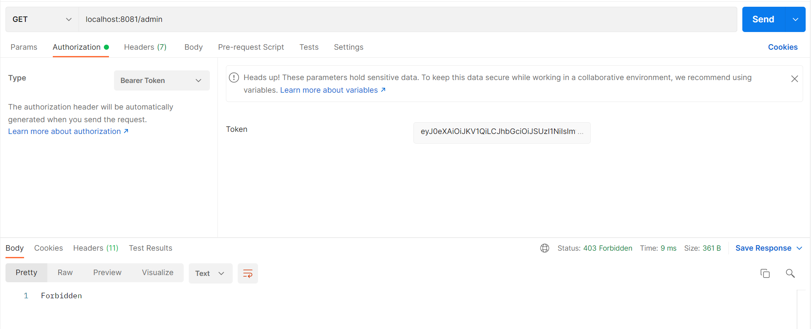
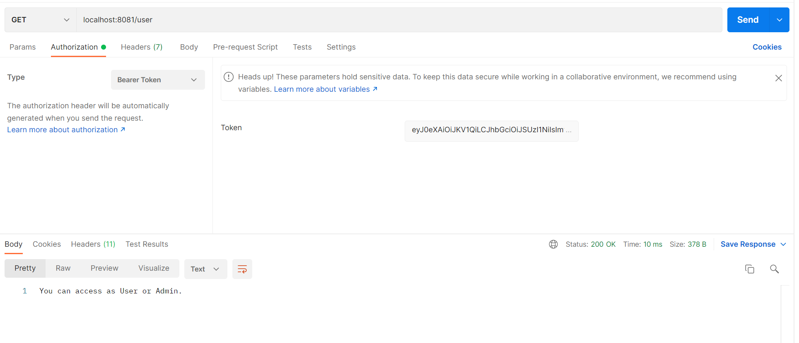
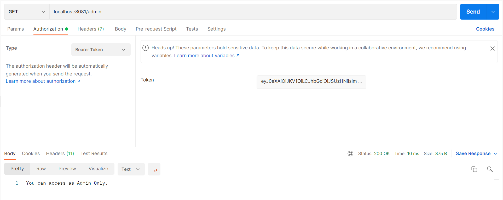
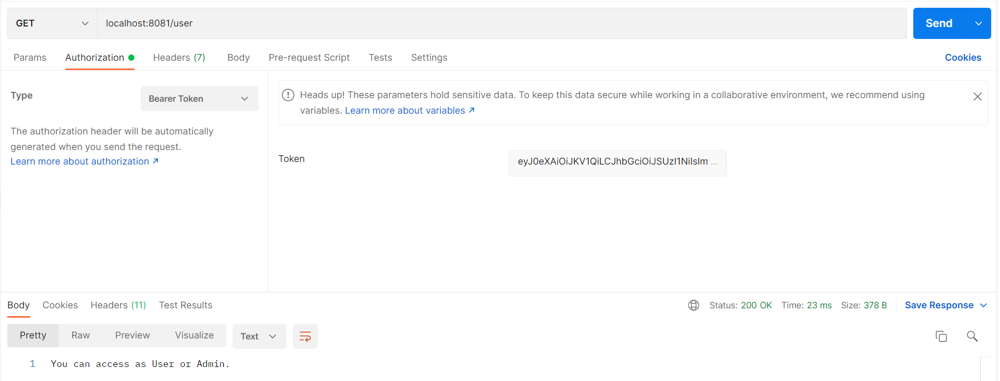
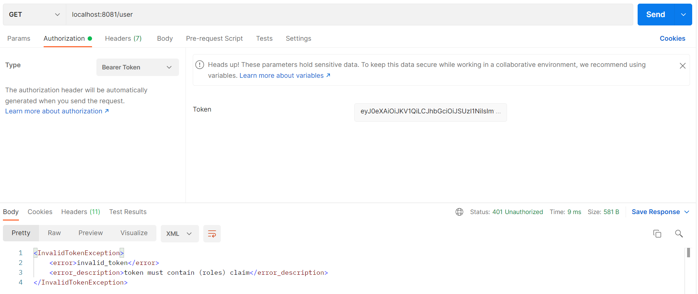
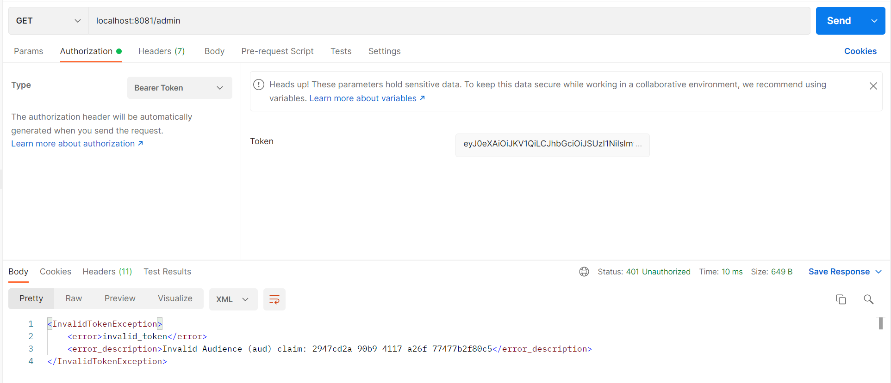
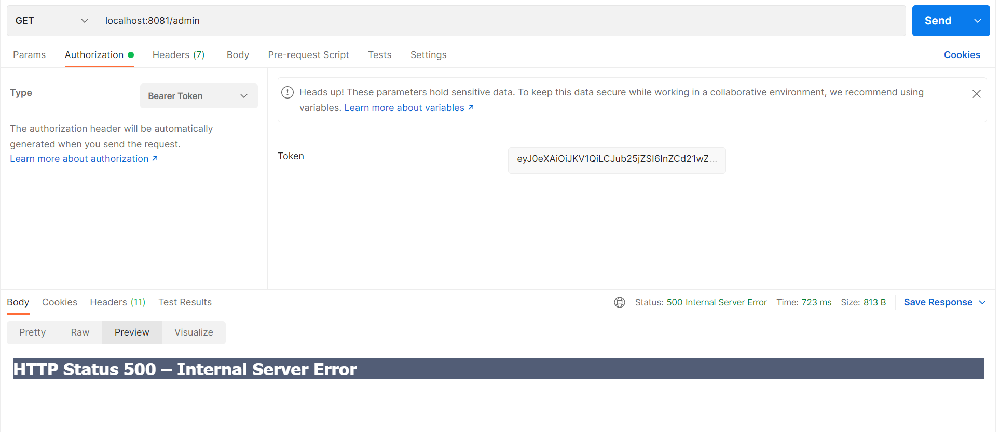

# JAVA Web API that utilizing App Roles to implement Role-Based Access Control

## Scenario

1. JAVA web API validates the access token using Spring Security and ensure that it contains the right app role. In doing so, it implements **Role-based Access Control** (RBAC) by using Azure AD **App Roles**.

1. JAVA web API validates the access token using Spring Security, exchanges the incoming access token for a Microsoft Graph access token using OAuth2.0 On-behalf-of flow, and uses the new access token to request information from the Graph Me endpoint.

## How to run this sample

To run this sample, you'll need:

- Working installation of Java and Maven
- An Azure Active Directory (Azure AD) tenant. For more information on how to get an Azure AD tenant, see How to get an Azure AD tenant
- An user account in your Azure AD tenant.

### Step 1: Download Java (8 and above) for your platform

To successfully use this sample, you need a working installation of [Java](https://openjdk.java.net/install/) and [Maven](https://maven.apache.org/).

### Step 2: Clone or download this repository

From your shell or command line:

```Shell
git clone https://github.com/blackadi/blackadi-MSAL4J-AppRole-RBAC.git
```

### Step 3: Register the sample with your Azure Active Directory tenant

#### Register the Web Api app (Java-webapi)

1. Navigate to the Microsoft identity platform for developers [App registrations](https://go.microsoft.com/fwlink/?linkid=2083908) page.
1. Click **New registration**.
1. In the **Register an application page** that appears, enter your application's registration information:
   - In the **Name** section, enter a meaningful application name that will be displayed to users of the app, for example `Java-webapi`.
   - Change **Supported account types** to **Accounts in any organizational directory and personal Microsoft accounts (e.g. Skype, Xbox, Outlook.com)**.
1. Click on the **Register** button to create the application.
1. In the app's registration **Overview** page, find the **Application (client) ID** and **Directory (tenant) ID** values and record it for use later. You'll need them to configure the configuration file(s) later in your code.
1. In the Application menu blade, click on the **Certificates & secrets** to open the page where we can generate secrets and upload certificates.
1. In the **Client secrets** section, click on **New client secret**:
   - Type a key description (for instance `app secret`),
   - Select one of the available key durations (for example **6 months**) as per your security concerns.
   - The generated key value will be displayed when you click the **Add** button. Copy the generated value for use in the steps later.
   - You'll need this key later in your code's configuration files. This key value will not be displayed again, and is not retrievable by any other means, so make sure to note it from the Azure portal before navigating to any other screen or blade.
1. In the Application menu blade, click on the **API permissions** to open the page where we add access to the Apis that your application needs.
   - Click the **Add a permission** button and then,
   - Ensure that the **Microsoft APIs** tab is selected.
   - In the _Commonly used Microsoft APIs_ section, click on **Microsoft Graph**
   - In the **Delegated permissions** section, select the **User.Read** in the list. Use the search box if necessary.
   - Click on the **Add permissions** button in the bottom.
1. In the Application menu blade, click on the **Expose an API** to open the page where declare the parameters to expose this app as an Api for which client applications can obtain [access tokens](https://docs.microsoft.com/azure/active-directory/develop/access-tokens) for.
   The first thing that we need to do is to declare the unique [resource](https://docs.microsoft.com/azure/active-directory/develop/v2-oauth2-auth-code-flow) URI that the clients will be using to obtain access tokens for this Api. To declare an resource URI, follow the following steps:
   - Click `Set` next to the **Application ID URI** to generate a URI that is unique for this app.
   - For this sample, accept the proposed Application ID URI (api://{clientId}) by selecting **Save**, and record the URI for later reference.
1. All Apis have to publish a minimum of one [scope](https://docs.microsoft.com/azure/active-directory/develop/v2-oauth2-auth-code-flow#request-an-authorization-code) for the client's to obtain an access token successfully. To publish a scope, follow the following steps:
   - Select **Add a scope** button open the **Add a scope** screen and Enter the values as indicated below:
     - For **Scope name**, use `access_as_user`.
     - Select **Admins and users** options for **Who can consent?**
     - For **Admin consent display name** type `Access Java-webapi`
     - For **Admin consent description** type `Allows the app to access Java-webapi as the signed-in user.`
     - For **User consent display name** type `Access Java-webapi`
     - For **User consent description** type `Allow the application to access Java-webapi on your behalf.`
     - Keep **State** as **Enabled**
     - Click on the **Add scope** button on the bottom to save this scope.
     - Record the scope's URI (api://{clientid}/access_as_user) for later reference.

##### Define the app Roles

1. Still on the same app registration, select the **App roles** blade to the left.
1. Select **Create app role**:
   - For **Display name**, enter a suitable name, for instance **PrivilegedAdmin**.
   - For **Allowed member types**, choose **User**.
   - For **Value**, enter **PrivilegedAdmin**.
   - For **Description**, enter **PrivilegedAdmins who can view the Admin Page**.
1. Select **Create app role**:
   - For **Display name**, enter a suitable name, for instance **RegularUser**.
   - For **Allowed member types**, choose **User**.
   - For **Value**, enter **RegularUser**.
   - For **Description**, enter **RegularUsers who can view the User Page**.
1. Select **Apply** to save your changes.

##### Assign users to app roles

To add users to the app role defined earlier, follow the guidelines here: [Assign users and groups to roles.](https://docs.microsoft.com/azure/active-directory/develop/howto-add-app-roles-in-azure-ad-apps#assign-users-and-groups-to-roles)

#### Register the client web app (Java-webapp)

1. Navigate to the Microsoft identity platform for developers [App registrations](https://go.microsoft.com/fwlink/?linkid=2083908) page.
1. Click **New registration**.
1. In the **Register an application page** that appears, enter your application's registration information:
   - In the **Name** section, enter a meaningful application name that will be displayed to users of the app, for example `java-webapp`.
   - Change **Supported account types** to **Accounts in any organizational directory and personal Microsoft accounts (e.g. Skype, Xbox, Outlook.com)**.
     > Note that there are more than one redirect URIs used in this sample. You'll need to add them from the **Authentication** tab later after the app has been created successfully.
1. Click on the **Register** button to create the application.
1. In the app's registration **Overview** page, find the **Application (client) ID** value and record it for later. You'll need it to configure the configuration file(s) later in your code.
1. In the app's registration screen, click on the **Authentication** blade in the left and:
   - In the **Platform configurations** section select **Add a platform** and create a new **Web** application
   - Enter the following as the redirect URI: `http://localhost:8080/msal4jsample/secure/aad`
   - Click on **Configure** to save your changes.
   - Click the **Save** button to save the the redirect URI changes.
1. In the Application menu blade, click on the **Certificates & secrets** to open the page where we can generate secrets and upload certificates.
1. In the **Client secrets** section, click on **New client secret**:
   - Type a key description (for instance `app secret`),
   - Select one of the available key durations (for example **6 months**) as per your security concerns.
   - The generated key value will be displayed when you click the **Add** button. Copy the generated value for use in the steps later.
   - You'll need this key later in your code's configuration files. This key value will not be displayed again, and is not retrievable by any other means, so make sure to note it from the Azure portal before navigating to any other screen or blade.
1. In the Application menu blade, click on the **API permissions** to open the page where we add access to the Apis that your application needs.
   - Click the **Add a permission** button and then,
   - Ensure that the **My APIs** tab is selected.
   - In the list of APIs, select the API you created previously, `Java-webapi`.
   - In the **Delegated permissions** section, select the **access_as_user** in the list.
   - Click on the **Add permissions** button in the bottom.

##### Define the app Roles

1. Still on the same app registration, select the **App roles** blade to the left.
1. Select **Create app role**:
   - For **Display name**, enter a suitable name, for instance **PrivilegedAdmin**.
   - For **Allowed member types**, choose **User**.
   - For **Value**, enter **PrivilegedAdmin**.
   - For **Description**, enter **PrivilegedAdmins who can view the Admin Page**.
1. Select **Create app role**:
   - For **Display name**, enter a suitable name, for instance **RegularUser**.
   - For **Allowed member types**, choose **User**.
   - For **Value**, enter **RegularUser**.
   - For **Description**, enter **RegularUsers who can view the User Page**.
1. Select **Apply** to save your changes.

##### Assign users to app roles

To add users to the app role defined earlier, follow the guidelines here: [Assign users and groups to roles.](https://docs.microsoft.com/azure/active-directory/develop/howto-add-app-roles-in-azure-ad-apps#assign-users-and-groups-to-roles)

#### Configure the **APPROLE-DEMO** to use your Azure AD tenant

Open `application.properties` in the src/main/resources folder. Fill in with your tenant and app registration information noted in the above registration step `java-webapp`.

- Replace _Enter_the_Tenant_Info_Here_ with **Directory (tenant) ID**.
- _Enter_the_Application_Id_here_ with the **Application (client) ID**.
- _Enter_the_Client_Secret_Here_ with the **key value** noted earlier.
- Find the references to `PrivilegedAdmin` and `RegularUser` app roles in this file. If necessary, change them to reflect the app role names you chose in the previous steps.

### Step 4: Run the applications

To run the project, you can either:

Run it directly from your IDE by using the embedded spring boot server or package it to a WAR file using [maven](https://maven.apache.org/plugins/maven-war-plugin/usage.html) and deploy it a J2EE container solution for example [Tomcat](https://tomcat.apache.org/maven-plugin-trunk/tomcat6-maven-plugin/examples/deployment.html)

#### Running from IDE

If you are running the application from an IDE, follow the steps below.

The following steps are for IntelliJ IDEA. But you can choose and work with any editor of your choice.

1. Navigate to _Run_ --> _Edit Configurations_ from menu bar.
2. Click on '+' (Add new configuration) and select _Application_.
3. Enter name of the application for example `webapi`
4. Go to main class and select from the dropdown, for example `DemoApplication` also go to _Use classpath of the module_ and select from the dropdown, for example `approle-demo`.
5. Select the created configuration and click **Run**. Now the project will run.

- This sample is using port 8081 <https://localhost:8081/{controllerMappingName}>

- You can use any rest API tools such Postman to test the webapi after generating accessToken with the needed claims via the registered app above`java-webapp`.

> For details about how to do this, follow the steps in this article or watch the [Getting started with Microsoft Graph Postman workspace](https://youtu.be/3RTHY3jScmA) video or follow the guide [here](https://docs.microsoft.com/en-us/graph/use-postman?view=graph-rest-1.0).

when access <https://localhost:8081/admin> with a signed-in user that has `RegularUser` Role will respond with a 403 - Forbidden.


when access <https://localhost:8081/user> with a signed-in user that has `RegularUser` Role will respond with a 200 - OK.


when access <https://localhost:8081/admin> with a signed-in user that has `PrivilegedAdmin` Role will respond with a 200 - OK.


when access <https://localhost:8081/user> with a signed-in user that has `PrivilegedAdmin` Role will respond with a 200 - OK.


when access <https://localhost:8081/user> with a signed-in user that does not has a `roles` claim matching to `PrivilegedAdmin` or `RegularUser` Roles will respond with a 401 - Unauthorized.


when access <https://localhost:8081/user> with a signed-in user that does not has a `scp` claim matching to `access_as_user` will respond with a 401 - Unauthorized.


### Known Issues

- when access <https://localhost:8081/user> with a signed-in user that is meant for MS graph instead, the webapi will respond with a 500 - Internal Server Error, since the signature did not match between MS-Graph API and custom defined API.
  
